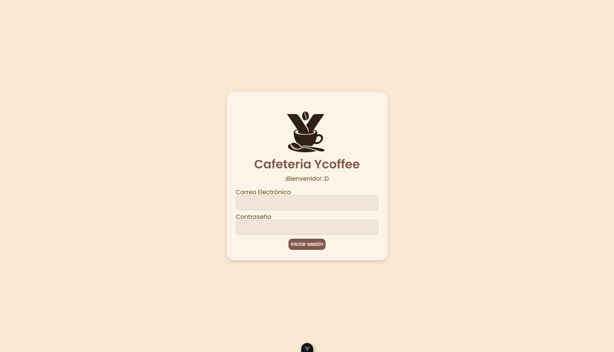
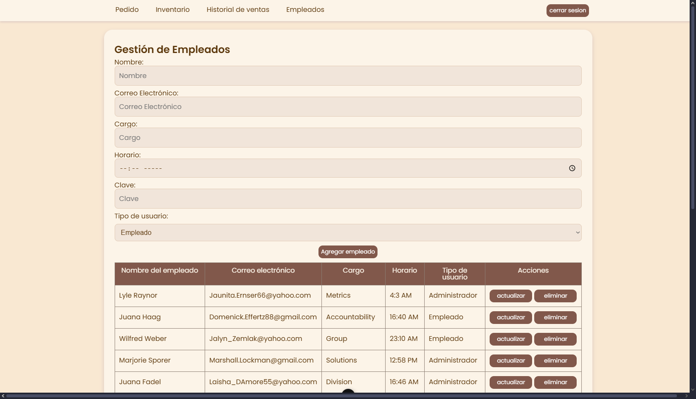

El proyecto consiste en un sistema de gestión para una cafetería, diseñado para facilitar la administración de pedidos, inventario y ventas. Este sistema proporciona una interfaz intuitiva tanto para los empleados que toman pedidos como para los administradores que supervisan el funcionamiento general de la cafetería.
Además, garantiza la seguridad de los datos y la eficiencia en el manejo de los procesos internos.

## Autores

<!-- Agrega aquí tu @username si has contribuido al proyecto -->

- [@Carlos Daniel Ramírez Álvarez](https://github.com/daaanielRA)
- [@Zharick Jineth Portillo Criado](https://github.com/Zharickjp13)
- [@Kristopher Alexis Verjel Rincón](https://github.com/KattoDev)

## Características

- **Gestión de Pedidos:**
  - Los empleados podrán tomar pedidos de los clientes, seleccionando:
    - los productos deseados
    - la cantidad correspondiente.
  - Se mostrará un resumen del pedido antes de confirmarlo, permitiendo realizar modificaciones si es necesario.
- **Inventario de Productos:**
  - El sistema mantendrá un registro actualizado del inventario de productos disponibles en la cafetería.
  - Se actualizará automáticamente el inventario cada vez que se realice un pedido.
- **Registro de Ventas:**
  - Se registrará cada venta realizada en la cafetería, incluyendo:
    - la fecha y hora de la venta
    - los productos vendidos
    - monto total
    - método de pago utilizado.
- **Gestión de Empleados:**
  - Se mantendrá un registro de los empleados que trabajan en la cafetería, incluyendo información como:
    - nombre
    - cargo
    - horario laboral
    - salario.
  - Los administradores podrán agregar, editar o eliminar empleados según sea necesario.
- **Autenticación y Autorización:**
  - Se implementa un sistema de autenticación para garantizar que solo los usuarios autorizados puedan acceder al sistema.
  - Definición de diferentes roles de usuario, cada uno con sus propios privilegios de acceso y funcionalidades.:
    - empleado
    - administrador

## Tecnologías utilizadas

- **Frontend:** Vue 3 + Vite
- **Estilos:** CSS
- **Base de datos:** Firebase
- **Autenticación:** Firebase Auth

> [!NOTE]
> El proyecto está alojado en una instancia de firebase y configurado con:

```
  |--> Firestore Database
  |----> para almacenar los datos de:
  |------> productos
  |------> usuarios
  |--> Authentication
  |----> para manejar las credenciales e
  |      inicios de sesión, teniendo como
  |      proveedores de credenciales:
  |------> Correo electrónico/contraseña
  |--> Hosting
  |----> para alojar la aplicación y mantenerla en tiempo real
```

## Capturas de pantalla

### login



### modulo de gestión de empleados



## Recursos utilizados en el proyecto

- **Tipografías:**
  - [Poppins](https://fonts.google.com/specimen/Poppins)
- **Iconos**
  - [Google Material Icons](https://fonts.google.com/icons)

## Ejecución local

has click [aquí](EXEC.md) para ver las instrucciones detalladas de ejecucion

## Contribuciones

¡Las contribuciones al proyecto siempre serán bienvenidas!
